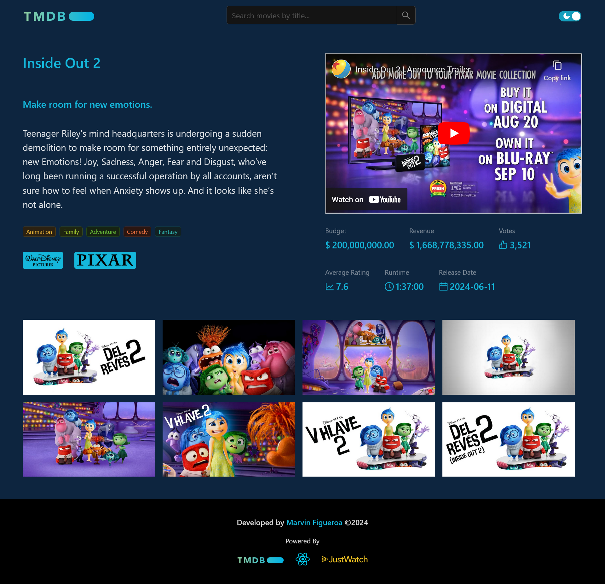
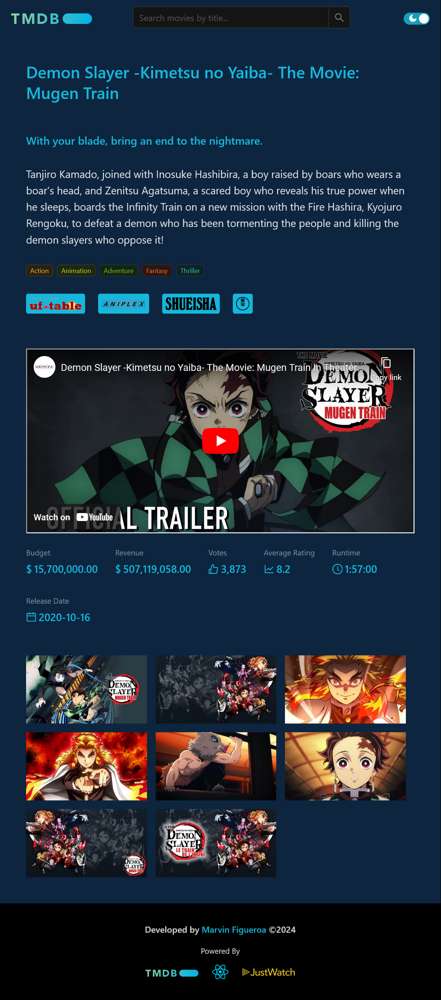
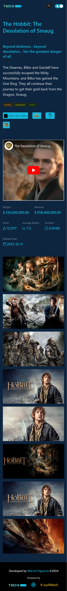

# Movie Hub - Powered By The Movie Database API

Aplicacion web desarrollada en React, que consume la API de TMDB para mostrar informacion de peliculas, con la posibilidad de filtrarlas por nombre, genero, proveedor, anio y ademas ordenar los resultados por popularidad, titulo, fecha y ganancias. Ademas permite ver el detalle de cada pelicula seleccionada mostrando imagenes de la misma, las productoras, generos, un breve resumen y el trailer alojado en YouTube.

## Tabla de contenidos

- [El desafio](#el-desafio)
- [Capturas](#capturas)
- [Despliegue](#despliegue)
- [Tecnologias utilizadas](#tecnologias-utilizadas)

## El desafio

La aplicacion debe permitir lo siguiente:

- Obtener todos las peliculas.
- Obtener una pelicula por ID.
- Obtener peliculas por nombre (búsqueda parcial).
- Mostrar una lista paginada de las peliculas.
- Incluye un campo de búsqueda para filtrar por nombre.
- Filtrar las peliculas por genero, anio, plataforma proveedora.
- Ordenar los resultados por popularidad, ganancias generadas, fecha de produccion, etc.
- Implementación de rutas y navegación entre páginas.
- Página de error 404 para rutas no encontradas.
- Pagina de error personalizada para errores de la aplicacion.

## Capturas

### Vista Desktop Inicial

### Vista Desktop Detalle

### Vista Tablet Detalle

### Vista Telefono Detalle

## Despliegue

- Web App: [Desplegada en Vercel](https://movie-hub-six-iota.vercel.app/)

## Tecnologias utilizadas

- Vite
- React
- TypeScript
- Custom Hooks
- Axios
- Zustand
- React Router
- Styled Components
- Ant Design
- React Query
- dayjs
